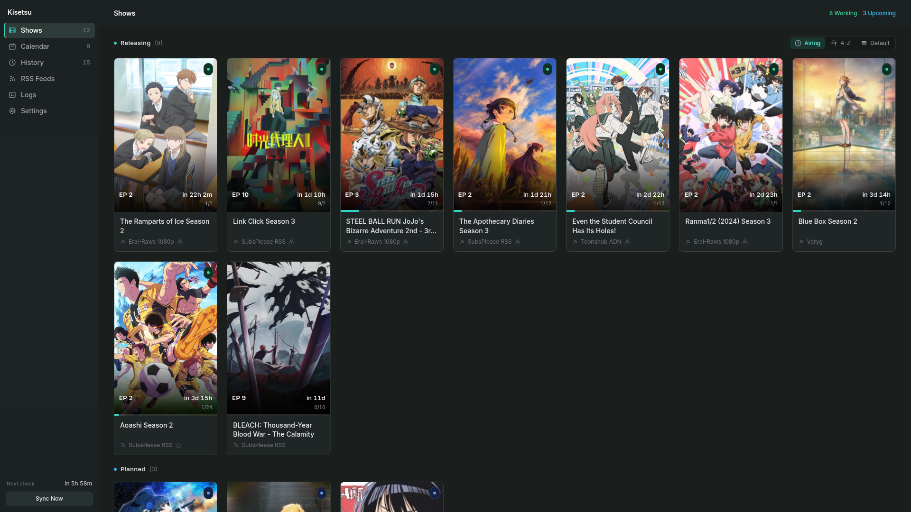
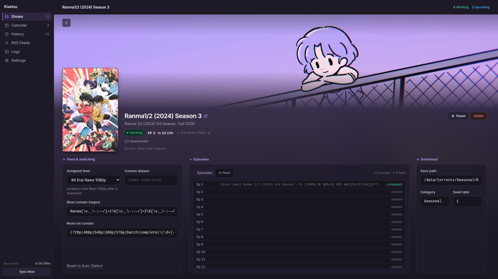
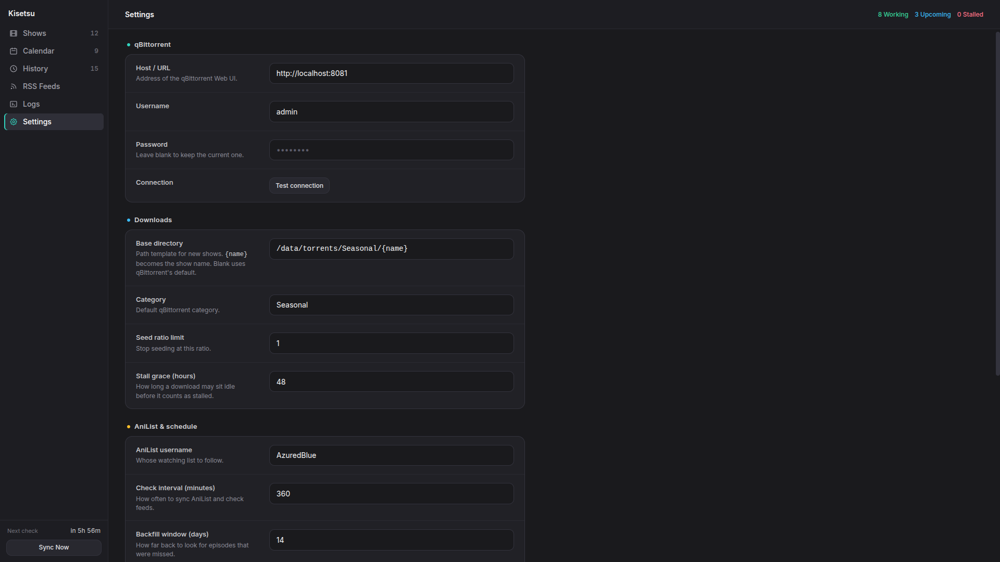
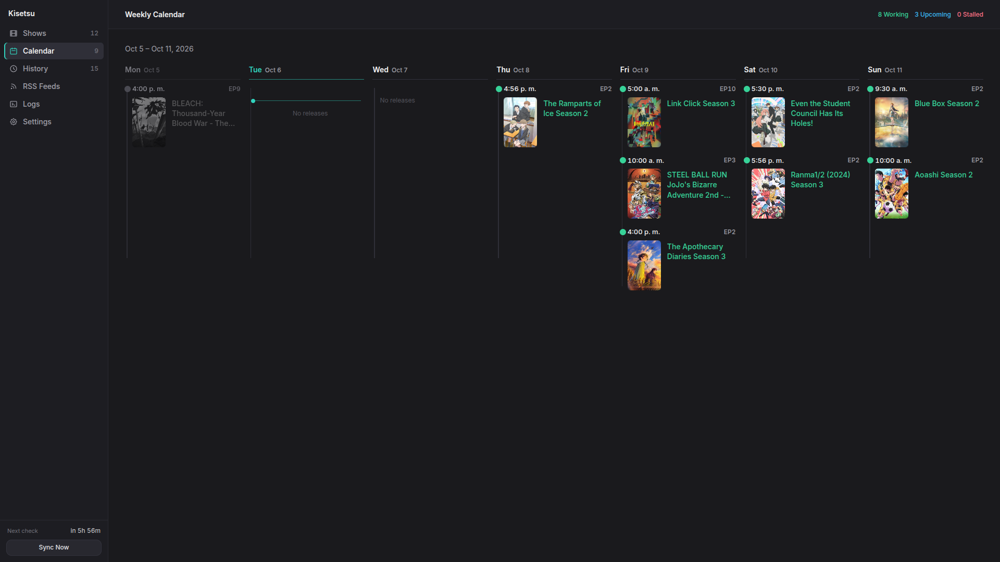

# qbit-seasonal-anime

A script that helps you manage your seasonal anime's RSS download rules automatically.

The WebUI is available at `http://localhost:8085`.

## Images

<div align="center">

| Dashboard | Editing |
|:---:|:---:|
|  |  |
| Settings | Calendar |
|  |  |
</div>

--- 

## Features
- **AniList Sync**: Automatically imports your seasonal anime watchlist.
- **RSS Feeds Ranking**: Give priority to certain RSS feeds for downloading your seasonal anime. Falls back automatically to other feeds if needed.
- **qBittorrent RSS Automation**: Automatically manages your qBittorrent auto-downloader rules for your seasonal anime.
- **Direct Downloads**: Optionally adds each new episode to qBittorrent itself and replaces a release when a v2 appears (see [Download modes](#download-modes)).
- **Calendar**: Creates a calendar for your seasonal anime.

---

## Installation

### Option 1:  `pipx` (Easiest)
```bash
pipx install git+https://github.com/AzuredBlue/qbit-seasonal-anime.git

# Run directly from anywhere
qbit-seasonal-anime
```

### Option 2: Clone & Run
```bash
git clone https://github.com/AzuredBlue/qbit-seasonal-anime.git
cd qbit-seasonal-anime

python3 -m venv .venv
source .venv/bin/activate
pip install -e .

# Run:
qbit-seasonal-anime
```

---

## Usage

After running it, you can open **`http://localhost:8085`** in your browser, where you can change some settings like the base download directory and connecting with your AniList and qBit.

After syncing with your AniList and making sure it can connect to qBit's WebUI, it will automatically create RSS Download Rules for each seasonal show. Once a show airs, it will automatically check for the best release (based on your RSS feed ranking) and adjust the RSS Download Rule so it matches it.

## Download modes

Choose the mode under **Settings**. Switching to Direct disables the managed RSS rules first.

- **Rules** (default): the app writes a qBittorrent RSS auto-download rule for each show and keeps it matched to the best release.
- **Direct**: the app reads your RSS feeds and adds each new episode to qBittorrent itself.
  - **Replacements**: when a v2 appears, it is added paused, rechecked and resumed. The v1 is kept until the v2 has completed and is seeding, then deleted with its files (unless both share the same files). If the replacement fails, the episode goes back to its previous release.
  - **Feed lock**: once a release really arrives from a feed, the show downloads only from that feed so episodes stay consistent. You can pick another feed in the show's editor.
  - **Missed episodes**: an aired episode that never showed up in the feeds is marked as missed and is not retried.
  - **Automatic Backfill Window (Days)**: how old an episode may be and still be downloaded when it first turns up (default 14).
  - **Early Air Tolerance (Hours)**: how far ahead of AniList's air time a release may appear and still be taken (default 6).

It is recommended to run this script at startup. On Windows, create a shortcut in the Startup folder; on Linux, use a systemd service.
