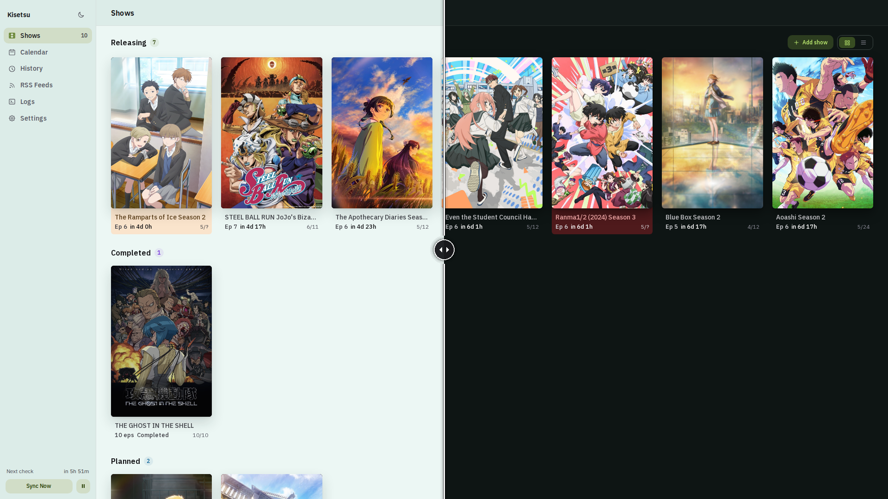
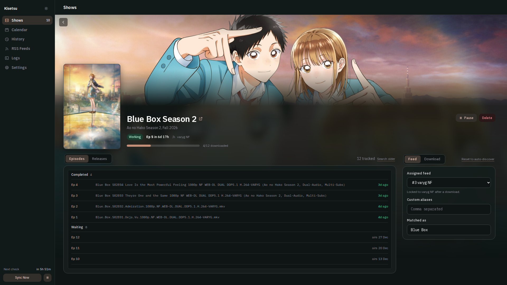
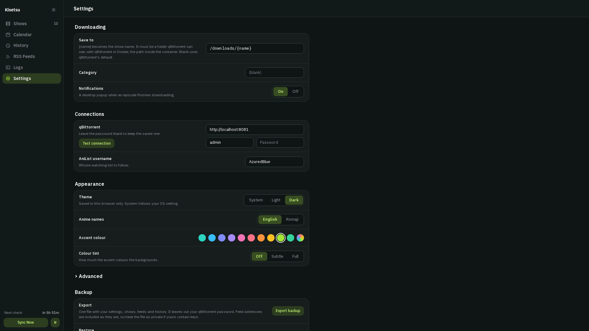
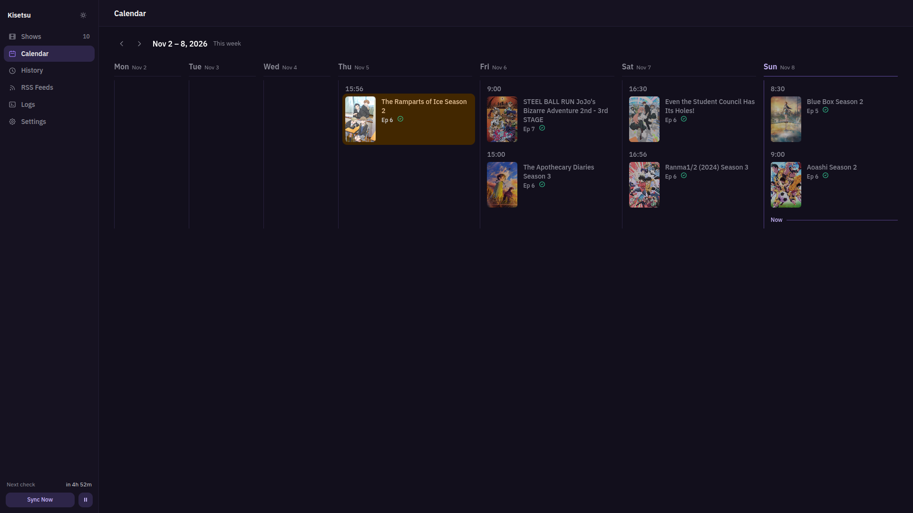

# Kisetsu

Kisetsu reads your AniList watching list and has qBittorrent download each new episode of your seasonal anime, by adding each torrent itself.

The WebUI is available at `http://localhost:8085`.

## Images

<div align="center">

| Dashboard | Editing |
|:---:|:---:|
|  |  |
| Settings | Calendar |
|  |  |
</div>

--- 

## Features
- **AniList Sync**: Automatically imports your seasonal anime watchlist.
- **RSS Feeds Ranking**: Give priority to certain RSS feeds for downloading your seasonal anime. Falls back automatically to other feeds if needed. Kisetsu reads the feeds itself, so qBittorrent's RSS does not need to be set up.
- **Direct Downloads**: Adds each new episode to qBittorrent itself and replaces a release when a v2 appears (see [How it downloads](#how-it-downloads)).
- **Windows and Linux**: Runs on both; settings and the database live in `%APPDATA%\kisetsu` on Windows and `~/.config/kisetsu` on Linux.
- **Calendar**: Creates a calendar for your seasonal anime.
- **Backup and Restore**: Export your settings, shows, feeds and history to one file from Settings, and restore it there or in the first-run setup on another machine. Your qBittorrent password stays out of the file, so you type it again when moving to a different qBittorrent.

---

## Installation

### Option 1:  `pipx` (Easiest)
```bash
pipx install git+https://github.com/AzuredBlue/kisetsu.git

# Run directly from anywhere
kisetsu
```

### Option 2: Clone & Run
```bash
git clone https://github.com/AzuredBlue/kisetsu.git
cd kisetsu

python3 -m venv .venv
source .venv/bin/activate
pip install -e .

# Run:
kisetsu
```

---

## Usage

After running it, you can open **`http://localhost:8085`** in your browser, where you can change some settings like the base download directory and connecting with your AniList and qBit.

The UI only listens on `127.0.0.1` by default. Run `kisetsu --host 0.0.0.0` to expose it to your LAN (there is no authentication), and `--port` to change the port.

After syncing with your AniList and making sure it can connect to qBit's WebUI, it will automatically download each new episode of your seasonal shows, picking the best release based on your RSS feed ranking.

## Updating

Stop Kisetsu, update it and start it again:

```bash
# Installed with pipx
pipx upgrade kisetsu

# Cloned
git pull
pip install -e .    # only needed when the dependencies changed
```

The database is migrated by itself the first time the new version starts. Before each migration step, a copy of it (`kisetsu.db.v<version>.<date>.bak`) is saved next to it. The copies a migration makes are all kept, along with the newest earlier ones up to three in all; older ones are deleted. A database made by a newer version is refused rather than touched, so go back to that version or point Kisetsu at another database.

## Command line

| Command | What it does |
|:---|:---|
| `kisetsu [PORT]` | Starts the app. `--port` (default 8085) and `--host` (default `127.0.0.1`) change where it listens. |
| `kisetsu --sandbox` | Runs a throwaway copy on port 8086 with a temporary database. Downloads are only pretended and logged; your real settings, qBittorrent and files are not touched. |
| `kisetsu import-legacy [FILE]` | Copies the settings, feeds, dismissed shows and per-show overrides from the database of the earlier releases (`anime.db` in the settings folder unless you give a file). It is opened read-only. |
| `kisetsu --adopt-report [FILE]` | A dry run of the first start on a throwaway database: imports the same old data, reads AniList and the feeds, adopts what qBittorrent already holds and lists what one grab pass would add. qBittorrent is only ever read. |

## How it downloads

Kisetsu fetches your RSS feeds itself (every 15 minutes by default, adjustable under **Settings**, and every few minutes for shows that are due to air) and adds each new episode to qBittorrent. To start from the feeds you already have in qBittorrent, use **Import from qBittorrent** on the RSS Feeds page; nothing is written back to qBittorrent's RSS list.

- **Replacements**: when a v2 appears, it is added paused, rechecked and resumed. The v1 is kept until the v2 has completed, whether it is then seeding or stopped by its seed limit, then deleted with its files (unless both share the same files). If the replacement fails, the episode goes back to its previous release and the v2 is tried again a few hours later.
- **Feed lock**: once a release really arrives from a feed, the show downloads only from that feed so episodes stay consistent. You can pick another feed in the show's editor.
- **Missed episodes**: an aired episode that never showed up in the feeds is marked as missed. It stays eligible: if a release turns up later, or **Search older** on the show finds one, it is downloaded.
- **Look early for new shows (h)** (Settings, Advanced): for a show's first episodes, how long before AniList's air time Kisetsu starts looking for a release (default 6).

It is recommended to run this script at startup. On Windows, create a shortcut in the Startup folder; on Linux, use a systemd service.
